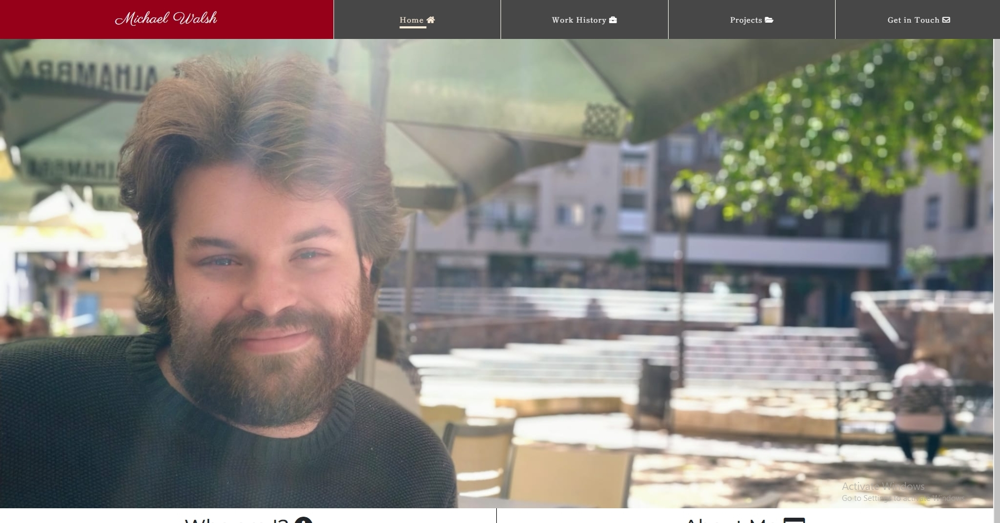

<h1 align="center">My Personal Website</h1>

[View the live project here.](https://michaelcwalsh7.github.io/milestone-project-1/)

This is a personal website advertising the skills and availability for work of Michael Walsh.

<h2 align="center">

## User Experience (UX)

-   ### User stories

    -   #### First Time Visitor Goals
        1. As a First Time Visitor, I want to be able to easily understand the purpose of the site and find out more about the 
        creator. For example, age, nationality, professional & personal interests.
        2. As a First Time Visitor, I want to be able to easliy navigate through the site, and have a clear understanding of what 
        the purpose of each page is and where it's most pertinnent information is. 
        3. As a First Time Visitor, I want to be able to check the employment status and professionalism of the creator, I also want to 
        locate their social media links to see their followings on social media and determine how trustworthy and legitimate they are.

    -   #### Returning Visitor Goals

        1. As a Returning Visitor, I want to be able to paint a picture of the creator's work history and education.
        2. As a Returning Visitor, I want to take a look at the projects that the creator has worked on in the past  and compare them to 
        my current ambitions for my own projects.
        3. As a Returning Visitor, I want to be able to contact the user with any questions or queries that I may have with the information
        provided.
        4. As a Returning Visitor, I want to be able to download or be emailed a copy of the creator's CV so that I may add a more traditional
        copy to my records.
        5. As a Returning Visitor, I want to be able to quicly and easily see where the creators skills and abilities lie within the field of 
        web design find out what kind of programming languages and frameworks that they have experience with. 

    -   #### Frequent User Goals
        1. As a Frequent User, I want to easily check to see if there are any newly added projects to see.
        2. As a Frequent User, I want to easily check to see if there are any newly added postings to the Work History section or any other 
        important updates to the creator's employment status.
        3. As a Frequent User, I want to sign up to the Newsletter so that I am emailed any major updates and/or changes to the website 
        or creator.

*   ### Design
    -   #### Colour Scheme
        - The two main colours used (right now) are a burgundyish red and a dark matte grey. The intention was to have a mixture of 
        a modern and a more romantic aesthetic; with the matte grey and burgundy representing those two ideas respectively. 
        - There is also a cream-white colour in use as it provides a nice contrast with the burgundy red. 
        - *Talk about navbar colours here*

    -   #### Typography
        - The two main fonts in use throughout the website are Shippori Mincho, and Montserrat, with Sans Serif as the fallback font for 
        both in case for any reason the fonts aren't being imported into the site correctly.
        - Shippori Mincho is a font based on The Tokyo Tsukiji Type Foundry No. 5 Mincho style. A common font in Japanese and Chinese
        typography, it has a much  more traditional look and feel than it's counterpart, Montserrat. This style is designed with the 
        intention of being used for long-form text setting in novels. As the website contains several instances of long-form dramtic prose, 
        including: sample chapters from a book, poetry and a short story, it is both attractive and appropriate.
        - Montserrat, on the other hand has a more modern feel and is a clean font used frequently in programming, so it is both attractive
        and appropriate.
        - The basic idea of having a mixture of two fonts used primarily throughout the website was to further compliment the idea of 
        blending modern and romantic aethetics, with Shippori Mincho of course representing romantic and Montserrat of course representing
        the modern.
        - There is also a third font that is present in the footer & header nametag home button areas. This font is Parisienne, with a 
        fallback of cursive in case for any reason the font isn't being imported into the site correctly. This font was used primarily
        as a way of extending the idea of having aspects of romantic aethetics in the website. 

    -   #### Imagery
        - Imagery is important. The large, background hero image is designed to be striking and catch the user's attention. I feel this 
        is well achieved by the close-up, high resolution nature of the image, and it's natural lighting. The hero image is also dual purpose,
        in that it has a kind of informative function; with first time users able to imply many things about the creator, with even a cursory 
        glance at the image. For example, things like: age, gender, ethnicity etc.
        - Other images on the Home page include icons in the currently section that represent the various different modules and programming
        languages that I will have been picking up from my progress with the code institute. These images offer an appealing variation in
        aesthetic and colour. But, also have an informative aspect to them by quickly and easliy indiciating to the user, what skills and 
        programming languages the creator is currently able to use, or will be able to use in the near future. Important information for 
        a prospective employer.
        - Other images in use are the company logos in the Work History section. These images provide a nice visual contrast and also a 
        more pleasant and better spaced format to the section. As the section contains a lot of text, the images are used to break up the 
        text, in such a way that clearly indicates to first time and frequent users alike, when one part of the Work History section has 
        begun, and another one has ended. They also serve an informative purpose for those users of the site who may recognise, or be 
        familiar with some of the aforementioned comapanies. This, of course, works better for some comapnies than for others. For instance: 
        One of the first comapnies mentioned, [Phoenix Architetural Salvage Ltd.](http://www.phoenixsalvage.ie/) is a small, niche company with 
        a fairly generic company logo, making it unlikely to be recognised by users. Other companies however, such as 
        [Supermacs](https://supermacs.ie/) or [English First](https://www.englishfirst.com/), are large-scale, multi-national corporations, 
        that prospective employers may recognise from thier logos alone. 
        - The Projects section of the website also has a plethora of images in use. However, it is important to note that these images do 
        not show up on all devices. These images only show up for those using laptops, desktops and larger screens. The decision was made
        to hide these images on smaller screens, as they took up far too much valuable screen space. In addition, their visaully striking nature, 
        gave a bombardment of visual images that led to a very poor user experience. Instead of the aforementioned images, a large, clickable link
        replaces the title of the project on both mobile and tablet. This link uses the colours associated with the project as a background, with 
        a copacetic, bi-colour, gradient effect. The way that the issue of a potential, visual overload was handled on larger screens, was to make 
        it more pleasant for the user, by utilising the z-index property of CSS3. This made it so that only one image of a project was visible 
        to the user at any one time. The remaining images were made visible to the user, when the titles of other projects on the left hand-side 
        were hovered over. This also had the added bonus effect of keeping the entire library of projects on a single, easy to understand & 
        navigate screen, eliminating the need for the user to have to scroll up and down throught the page to find the many different projects 
        available.

*  ### Wireframes

    -   Home Page Wireframes 
        - [Mobile](https://michaelcwalsh7.github.io/milestone-project-1/assets/images/README-images/wireframes/mobile/mobile-home.png) 
        - [Tablet](https://michaelcwalsh7.github.io/milestone-project-1/assets/images/README-images/wireframes/tablet/tablet-home.png) 
        - [Desktop](https://michaelcwalsh7.github.io/milestone-project-1/assets/images/README-images/wireframes/desktop/desktop-home.png)

    -   Work History Wireframes - 
        - [Mobile](https://michaelcwalsh7.github.io/milestone-project-1/assets/images/README-images/wireframes/mobile/mobile-work-history.png) 
        - [Tablet](https://michaelcwalsh7.github.io/milestone-project-1/assets/images/README-images/wireframes/tablet/tablet-work-history.png) 
        - [Desktop](https://michaelcwalsh7.github.io/milestone-project-1/assets/images/README-images/wireframes/desktop/desktop-work-history.png)

    -  Projects Wireframes - 
        - [Mobile](https://michaelcwalsh7.github.io/milestone-project-1/assets/images/README-images/wireframes/mobile/mobile-projects.png) 
        - [Tablet](https://michaelcwalsh7.github.io/milestone-project-1/assets/images/README-images/wireframes/tablet/tablet-projects.png) 
        - [Desktop](https://michaelcwalsh7.github.io/milestone-project-1/assets/images/README-images/wireframes/desktop/desktop-projects.png)

    -  Example Project Wireframes - 
        - [Mobile](https://michaelcwalsh7.github.io/milestone-project-1/assets/images/README-images/wireframes/mobile/mobile-example-project.png) 
        - [Tablet](https://michaelcwalsh7.github.io/milestone-project-1/assets/images/README-images/wireframes/tablet/tablet-example-project.png) 
        - [Desktop](https://michaelcwalsh7.github.io/milestone-project-1/assets/images/README-images/wireframes/desktop/desktop-example-project.png)

    -   Get in Touch Wireframes - 
        - [Mobile](https://michaelcwalsh7.github.io/milestone-project-1/assets/images/README-images/wireframes/mobile/mobile-get-in-touch.png) 
        - [Tablet](https://michaelcwalsh7.github.io/milestone-project-1/assets/images/README-images/wireframes/tablet/tablet-get-in-touch.png) 
        - [Desktop](https://michaelcwalsh7.github.io/milestone-project-1/assets/images/README-images/wireframes/desktop/desktop-get-in-touch.png)

## Features

-   Responsive on all device sizes

-   Interactive elements

-   Audio & visual content.

## Technologies Used

### Languages Used

-   [HTML5](https://en.wikipedia.org/wiki/HTML5)
-   [CSS3](https://en.wikipedia.org/wiki/Cascading_Style_Sheets)

### Frameworks, Libraries & Programs Used

1. [Bootstrap v5.0:](https://getbootstrap.com/docs/5.0/getting-started/introduction/)
    - Bootstrap was used to assist with the responsiveness and styling of the website.
1. [Hover.css:](https://ianlunn.github.io/Hover/)
    - Hover.css was used on the 4 different buttons on the navbar on desktopsand larger screens.
1. [Google Fonts:](https://fonts.google.com/)
    - Google Fonts were used to import the 'Shippori Mincho', 'Montserrat' and 'Parisienne' fonts into the style.css file which are used on 
    all pages throughout the project. 
    - Google Fonts were also used to import the 'Exo' & 'Oswald' fonts into the style.css file which are fonts not really used in this website,
    but rather fonts that are native to other projects that I've worked on. The font used in the link to those projects, matches the main heading
    fonts used on those websites. ('Exo' for Rosie Odenkirk, & 'Oswald' for Love Running)
1. [Font Awesome:](https://fontawesome.com/)
    - Font Awesome was used on all pages throughout the website to add icons for aesthetic and UX purposes.
1. [Git](https://git-scm.com/)
    - Git was used for version control by utilizing the Gitpod terminal to commit to Git and Push to GitHub.
1. [GitHub:](https://github.com/)
    - GitHub is used to store the projects code after being pushed from Git.
1.  [Microsoft Paint:](https://support.microsoft.com/en-us/windows/get-microsoft-paint-a6b9578c-ed1c-5b09-0699-4ed8115f9aa9)
    - Microsoft Paint was used to  crop & resize images, as well for changing the file types of images saved from online.
1.  [Balsamiq:](https://balsamiq.com/)
    - Balsamiq was used to create the [wireframes](https://github.com/) during the design process.

## Testing

The W3C Markup Validator and W3C CSS Validator Services were used to validate every page of the project to ensure there were no syntax errors in the project.

-   [W3C Markup Validator](https://jigsaw.w3.org/css-validator/#validate_by_input) - [Results](https://github.com/)
-   [W3C CSS Validator](https://jigsaw.w3.org/css-validator/#validate_by_input) - [Results](https://github.com/)

### Testing User Stories from User Experience (UX) Section